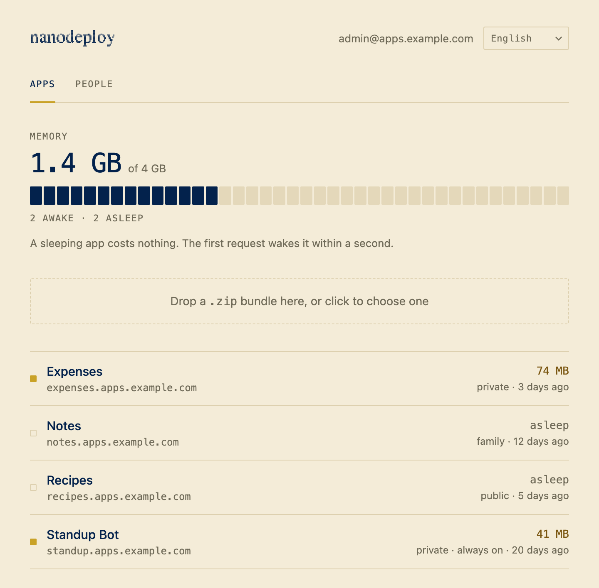
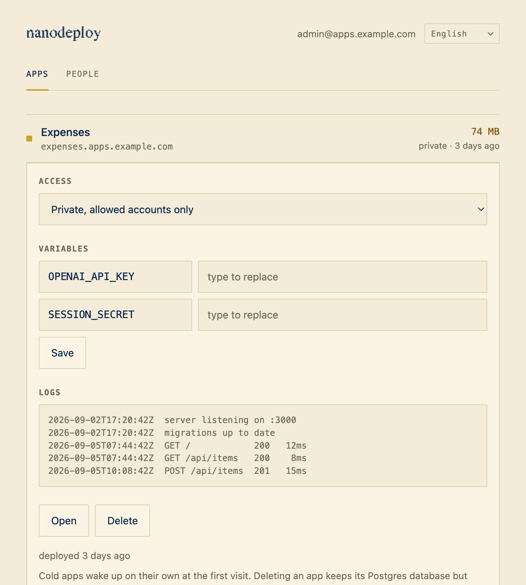
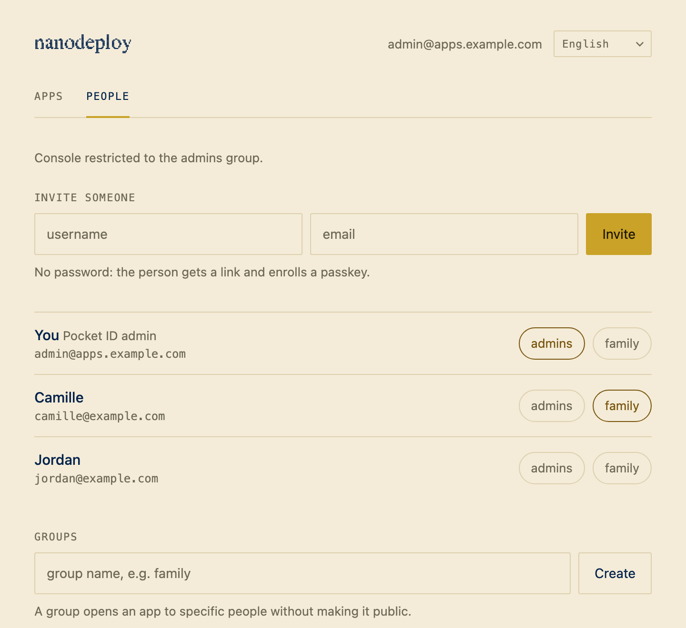
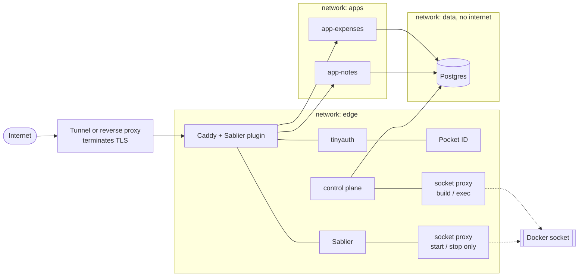

<p align="center">
  
</p>

**Your own Vercel, on a 4 GB box in a cupboard.** Apps sleep when nobody uses
them, wake in about a second, and share one login and one Postgres. Ships with a
**Claude skill that writes and deploys new apps from a sentence** —
[jump to it](#build-apps-by-asking).

<p align="center">
  
</p>

  

---

## The idea

A budget tracker you open twice a week doesn't deserve a VPS. But five of them on
one small machine means five idle Node processes eating the RAM you needed for
the sixth.

So Nanodeploy stops them. An app with no traffic is a stopped container — zero
RAM, zero CPU — and the next request starts it back up before the page finishes
loading. A Jetson Nano with five apps deployed sits at **1.4 GB of 4 GB**,
Postgres, identity provider and gateway included.

You still get what makes hosting worth it: a domain per app, HTTPS, one account
across everything, a database per app, and a deploy that is one command or one
drag of a `.zip`.

## What it costs to run

| Component | Job | RAM at rest |
|---|---|---|
| Caddy + Sablier plugin | routing, static files, waking apps | ~25 MB |
| Sablier | stops and starts containers on demand | ~15 MB |
| Postgres 16 | one database and one role per app | ~60 MB |
| Pocket ID | accounts, passkeys, groups | ~15 MB |
| tinyauth | forward-auth in front of every private app | ~10 MB |
| control plane | uploads, provisioning, routes | ~50 MB |
| two socket proxies | least-privilege Docker access | ~10 MB |

A woken app costs ~40 MB, capped at 256 MB. One that must answer instantly can
opt out of sleeping for that same 40 MB, permanently.

## Deploying

```bash
cp -r templates/app-template my-app && cd my-app
npm install
export NANODEPLOY_URL=https://deploy.apps.example.com NANODEPLOY_TOKEN=...
npm run deploy
```

Your machine builds; the server compiles nothing. It gets a zip, builds a small
image, runs migrations once, and puts the container back to sleep. No terminal?
Drag the zip onto the dashboard.

The whole contract is one file:

```yaml
name: Expenses
slug: expenses          # -> expenses.apps.example.com
access: private         # public | private | groups
backend: { entry: server.js, port: 3000 }
database: { enabled: true, migrations: ./migrations }
idle: { timeout: 10m, warm: false }
env: [OPENAI_API_KEY]   # names only, values are typed in the dashboard
```

## Running it



Click an app for its access mode, environment variables, logs and live memory.
Access is a dropdown, not a redeploy: **private** (accounts you created),
**groups** (people you pick), or **public** (the whole internet — the dashboard
warns you). Env values are write-only: you can replace a secret, not read it back.

## One account for everything



No passwords anywhere. Invite by email, hand over a single-use link, the person
enrolls a passkey. That one account opens every app they're allowed to see, and
your apps write zero auth code — the gateway hands them the user in a header.

The console can deploy code and drive Docker, so whoever reaches it has root on
the machine. A fresh install is single-user and open; invite a second person and
the dashboard makes you pick an admin group first.

## How it is wired



One rule: **an app reaches the gateway and its own database, nothing else.** The
Docker socket, Sablier, tinyauth and the control plane sit on a network no app
joins — an app is arbitrary code, and the socket is a root escape. Even Sablier
and the control plane never touch the raw socket; each gets a proxy scoped to its
job. Apps run non-root, all capabilities dropped, read-only filesystem, 256 MB
cap, no published port.

## Install

You need Docker + Compose v2 (on storage that isn't an SD card), a domain with a
**wildcard** `*.apps.example.com` pointing at the machine (a
[Cloudflare tunnel](https://developers.cloudflare.com/cloudflare-one/connections/connect-networks/)
is easiest behind a home router), and Node 20 on your laptop.

```bash
git clone https://github.com/theosorus/nanodeploy && cd nanodeploy
./install.sh          # writes .env with fresh secrets, then stops
$EDITOR .env          # set APPS_DOMAIN and APPS_DIR
./install.sh          # builds and starts everything
```

Then point your tunnel at `http://localhost:8080`, create your account at
`https://id.apps.example.com`, wire an OIDC client for tinyauth, and put a Pocket
ID API key in `.env`. The installer prints each step with your domain filled in.

> **The wildcard is not optional.** The tunnel rule says where a request goes
> once it arrives; the `*` DNS record is what makes it arrive. With the first but
> not the second, every app deploys and runs while the browser says "server not
> found".

After a power cut the machine comes back on its own, if you install the unit
once (`sudo cp nanodeploy.service /etc/systemd/system/ && sudo systemctl enable
nanodeploy`): the control plane rebuilds any missing container, image or route
from the bundles on disk. Back up with `pg_dumpall`, and stop with `docker
compose stop`, never `down` — `down` deletes the networks and the app containers
become unstartable.

## Build apps by asking

"Build me an app" fails with a chatbot because there are a thousand ways to
build it. Here there is one: fixed frontend, backend, database, auth, deploy.
Nothing to get wrong. So Nanodeploy ships a Claude skill,
[`skills/nanodeploy-app/`](skills/nanodeploy-app), with the whole contract built
in. Install it and describe what you want:

> **You:** build me something to track shared expenses with my flatmates

It asks the questions that change the result — who it's for, what data, and
**three named art directions** so it doesn't look like every other generated app
— then writes the schema, API, frontend and manifest and deploys it. You get a
URL. It also knows what quietly breaks a sleeping app (no in-memory state, no
timers, the first-wake retry, an `ownerId` filter on every query), so the result
survives its second visit.

Prefer to write it yourself? [`app-template/`](templates/app-template) is the
same starting point: `cp -r`, edit, `npm run deploy`.

## What it does not do

Stated plainly, because finding out later is worse:

- **No rollback.** A deploy replaces the container. Keep your bundles.
- **Apps see each other** on a shared network. Don't put an app open to strangers
  next to something sensitive.
- **App secrets sit in clear text** in the control database. Encrypt backups.
- **Nothing is backed up for you.** One shared Postgres, one point of loss.
- **Websockets don't survive sleeping.** Poll, or use reconnecting SSE.
- **The first request after sleeping gets a waiting page**, not JSON — the
  template's fetch wrapper retries it; a bare `fetch` breaks silently.
- **No rate limiting.** Put the console behind an outer access layer.

[SECURITY.md](SECURITY.md) is the full threat model: what is enforced, and what
is deliberately not.

## Licence

MIT. See [LICENSE](LICENSE) and [CONTRIBUTING.md](CONTRIBUTING.md).
